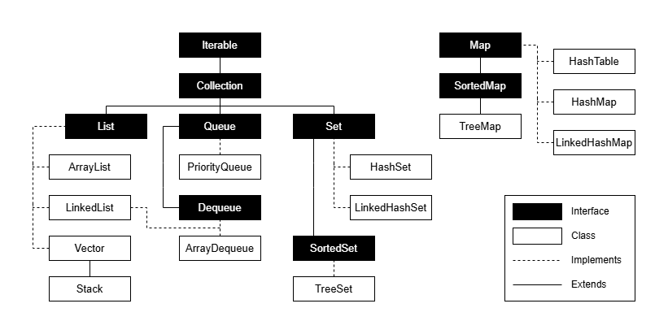

# DIO - Trilha POO Java

        <picture>
                <source media="(prefers-color-scheme: light)" srcset="https://img.shields.io/badge/Java-black?style=for-the-badge&logo=OpenJDK&logoColor=white">
                
        </picture>
        <picture>
                <source media="(prefers-color-scheme: light)" srcset="https://img.shields.io/badge/Maven-black?style=for-the-badge&logo=ApacheMaven&logoColor=white">
                
        </picture>
        <picture>
                <source media="(prefers-color-scheme: light)" srcset="https://img.shields.io/badge/Spring_Boot-black?style=for-the-badge&logo=SpringBoot&logoColor=white">
                
        </picture>

## Autora dos Exercícios e Repositório Original
- [Camila Cavalcante](https://github.com/cami-la)
- [Collections Java](https://github.com/cami-la/collections-java-api-2023)

## Java Collections Framework
A plataforma Java fornece o framework `Collections` que provê aos desenvolvedores uma arquitetura para representar e manipular coleções. Uma coleção é um objeto que representa um grupo de objetos.

## Exercícios
Este repositório contém exercícios que colocam em prática os seguintes temas:

- Comparable x Comparator
- Generics
- Interface List
- Interface Map
- Interface Set

## Hierarquia
Esta é a hierarquia do framework Collections e apesar da interface `Map` não ser filha direta de `Collection`, ela também é considerada uma coleção por conta de sua função.

        

## Referências
- Java Collections Framework - Oracle: https://docs.oracle.com/en/java/javase/21/core/java-collections-framework.html
- Collections Framework in Java - Data Flair: https://data-flair.training/blogs/collection-framework-in-java/